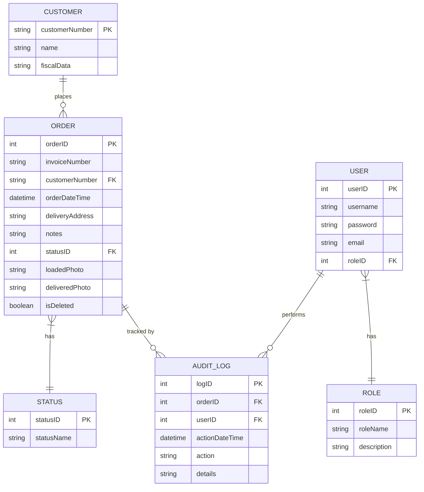

# Halcon Web Application Analysis and Diagrams

## Overview
Halcon is a construction material distributor that requires a web application to automate its internal processes. This repository contains the analysis documentation and design diagrams for the proposed system.

## Table of Contents
1. [Project Description](#project-description)
2. [Functional Requirements](#functional-requirements)
3. [User Roles and Permissions](#user-roles-and-permissions)
4. [Order Lifecycle Process](#order-lifecycle-process)
5. [Diagrams](#diagrams)
6. [Work Methodology](#work-methodology)
7. [Work Methodology](#chosen-database)

## Project Description
Halcon’s proposed web application will serve two primary audiences:
- **Customers:** Who can check the status of their orders by entering their customer number and invoice number.
- **Internal Personnel:** Who use an administrative dashboard to manage orders and perform tasks specific to their department.

The application will support the entire order lifecycle from order creation to final delivery, including photo uploads for proof of shipment and delivery.

## Functional Requirements
### Customer-Facing Features:
- **Order Status Inquiry:** 
  - A main screen where a customer enters a customer number and invoice number.
  - Display the current status of the order.
  - If the status is “Delivered”, show a photo as evidence of delivery.

### Administrative Features (Internal Personnel):
- **User Management:**
  - A default administrative user exists to register new users and assign roles.
  - **Roles:** Sales, Purchasing, Warehouse, and Route.
- **Order Management:**
  - Sales personnel create new orders capturing:
    - Consecutive invoice number
    - Customer name/company
    - Unique customer number
    - Fiscal data (for invoice purposes)
    - Date and time of order
    - Delivery address
    - Additional notes
  - **Order Lifecycle Statuses:**
    - **Ordered:** Order entry by Sales.
    - **In Process:** Order is being prepared (either from internal stock or via purchase).
    - **In Route:** Order is on its way; at this stage, the Route department uploads a photo of the loaded unit.
    - **Delivered:** Delivery confirmation; a photo is uploaded as evidence.
- **Order Listing and Search:**
  - A screen listing all orders with filtering by Invoice Number, Customer Number, Date, or Status.
- **Logical Deletion and Restoration:**
  - Orders can be modified or marked as “deleted” (logical deletion).
  - A separate screen lists deleted orders, with options to edit or restore them.

## User Roles and Permissions
- **Administrator:** Can register new users and assign departmental roles.
- **Sales:** Responsible for taking customer orders.
- **Purchasing:** Handles orders for missing materials.
- **Warehouse:** Manages stock, prepares orders, and communicates with Purchasing.
- **Route:** Uploads photos for both loaded and delivered orders (this option is visible only to Route users).
- **Customer:** No registration required; customers can check their order status via a public-facing screen.

## Order Lifecycle Process
1. **Order Placement:**
   - A customer calls, and the Salesperson enters the order details.
2. **Initial Status – Ordered:**
   - The order is logged and visible to all departments.
3. **Processing – In Process:**
   - A Warehouse user prepares the order; if items are missing, Purchasing is involved.
4. **Dispatch – In Route:**
   - The order is marked “In route” once ready, and a Route user loads the order, uploading a “loaded” photo.
5. **Delivery Confirmation – Delivered:**
   - Upon delivery, the Route user uploads a “delivered” photo.
   - The system updates the order status to “Delivered.”

## Diagrams
Below are the planned diagrams for this project (actual diagrams in the `/diagrams` folder):

- **BPMN Diagram:** Illustrates the business processes and workflow for order management.
- **Class Diagram:** Defines the classes, their attributes, and methods for the system.
- **Activity Diagram:** Details the step-by-step process of the order lifecycle.
- **Use Case Diagram:** Illustrates the interactions between users (Customer, Sales, Purchasing, Warehouse, Route, Administrator) and system functionalities.
- **ER Diagram:** Defines the database entities (Orders, Users, Roles, etc.) and their relationships.

## Work Methodology

For the planning and execution of this project, an **Agile methodology (specifically Scrum)** is ideal. 

**Justification:**

- **Iterative Development:** The project involves multiple user roles and a complex order lifecycle. Scrum’s iterative sprints allow for gradual development, testing, and refinement of each feature.
- **Flexibility:** As feedback is received from stakeholders (Sales, Purchasing, Warehouse, Route, and Administration), requirements can be reassessed and prioritized in subsequent sprints.
- **Collaboration:** Regular Scrum meetings (daily stand-ups, sprint planning, reviews, and retrospectives) promote continuous communication among team members and ensure alignment with project goals.
- **Risk Management:** Frequent iterations help identify and mitigate issues early in the development process, reducing overall project risk.
- **Transparency:** Scrum’s emphasis on a clear backlog and regular reviews keeps all stakeholders informed about progress and any changes in priorities.

This agile approach not only supports efficient planning and execution but also ensures that the final application is well-aligned with the evolving needs of Halcon’s diverse user base.

## Chosen Database

For this project, we have chosen **MySQL** as the database management system due to the following reasons:

- **Relational Structure:** MySQL is well-suited for structured data with well-defined relationships, making it ideal for handling orders, users, and roles.
- **Scalability & Performance:** It efficiently handles a growing dataset and ensures fast query execution.
- **Data Integrity & Security:** Supports ACID compliance, ensuring data reliability and role-based access control.
- **Widespread Support:** MySQL is widely used in enterprise applications and has strong community and commercial support.

### **Entity-Relationship Diagram**
The following diagram represents the structure of the database:

